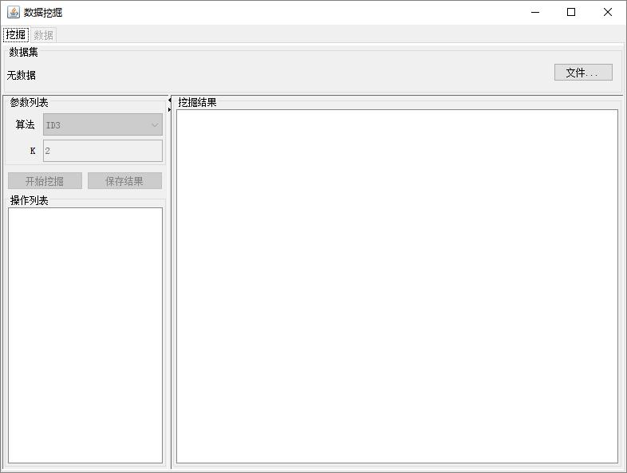
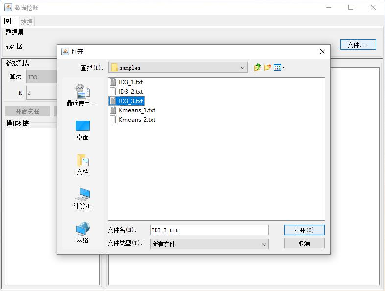
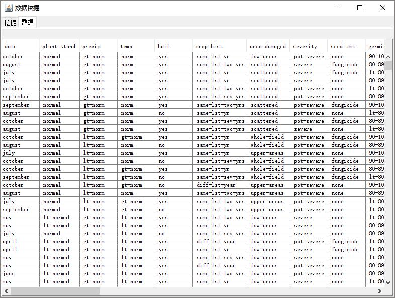
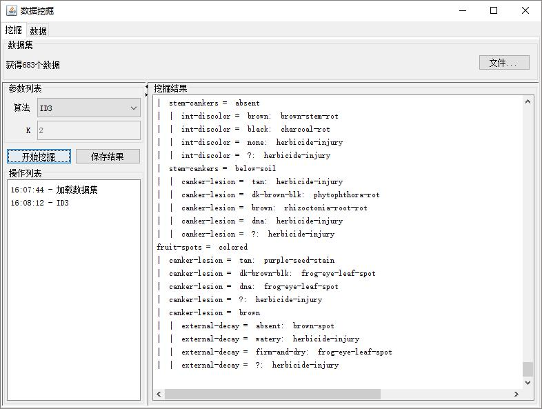

# 数据挖掘

数据挖掘算法软件。

## 开发环境
* Eclipse 4.2.2 (Juno)
* JDK 1.5

## 代码结构
* algorithm -- 算法集，可自由加入算法
  * ID3 -- ID3 实现
  * Kmeans -- K-means 实现
* data -- 数据结构
  * DataSet.java -- 数据集类
  * Attribute.java -- 属性类
  * Instance.java -- 实例（数据）类
* gui -- 界面集
  * Main.java -- 主面板
  * AnalysisPanel.java -- 分析面板
  * DataPanel.java -- 数据面板
* util -- 工具集
  * Reader.java -- 数据读取工具

## 使用

### 主面板

### 加载文件

### 数据面板

### ID3

### K-means

## 许可证
[Apache 许可证 2.0](LICENSE)